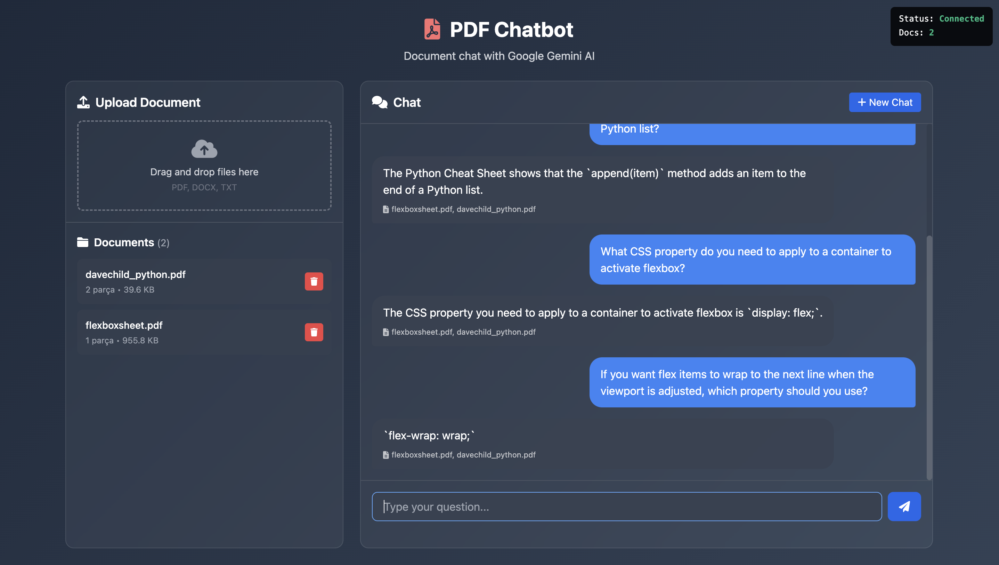
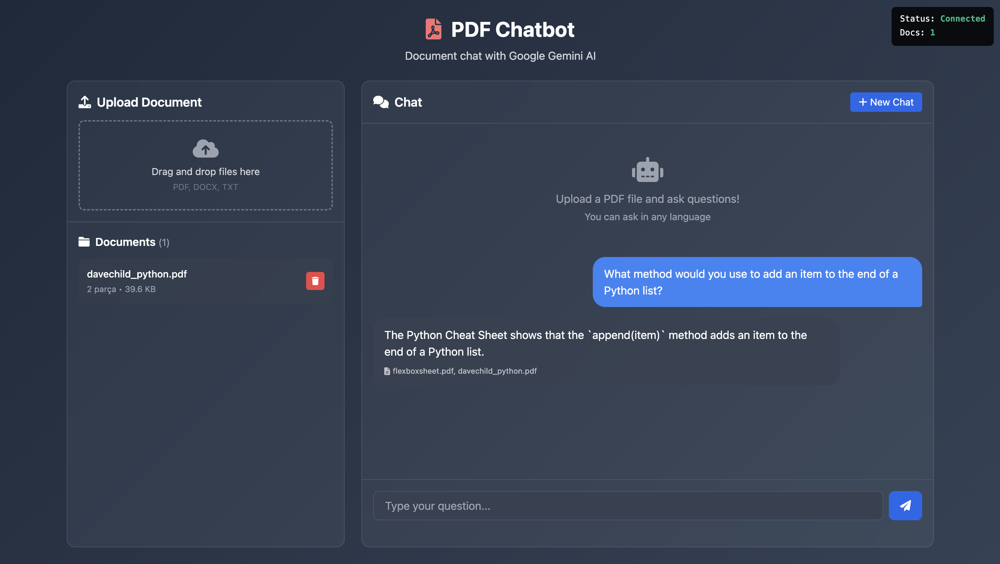
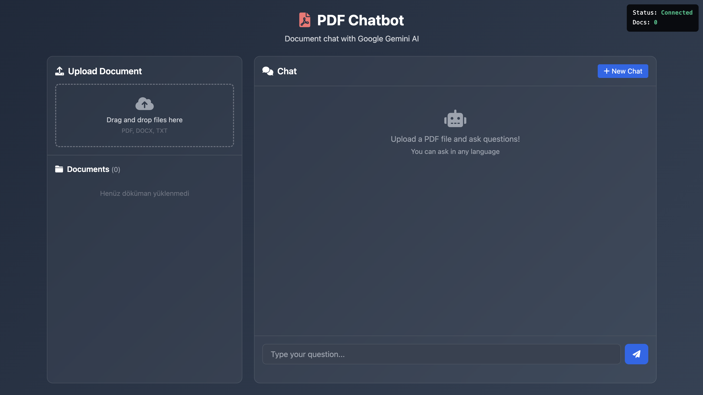

# 🤖 PDF Chatbot with Google Gemini AI

A powerful, multilingual PDF document chatbot that allows users to upload documents (PDF, DOCX, TXT) and ask questions about their content in any language. Built with Google Gemini AI for intelligent document analysis and natural language responses.


## 📸 Demo

### 🎬 Live Application Demo
<div align="center">
  
  <br/>
  <em>🔥 Watch the PDF Chatbot in action with multilingual support!</em>
</div>

> **✨ Key Features Shown:**
> - 📄 Document upload and processing
> - 🤖 Real-time AI responses with Google Gemini
> - 🌍 Multilingual question answering
> - 📱 Responsive design across devices

### 🖼️ Interface Screenshots

<table>
  <tr>
    <td align="center">
      
      <br/>
      <strong>Multi-document Chat Interface</strong>
      <br/>
      <em>Upload multiple PDFs and ask questions across documents</em>
    </td>
    <td align="center">
      
      <br/>
      <strong>Intelligent Q&A System</strong>
      <br/>
      <em>Get precise answers with source attribution</em>
    </td>
  </tr>
  <tr>
    <td align="center" colspan="2">
      
      <br/>
      <strong>Clean & Modern Interface</strong>
      <br/>
      <em>Intuitive design with multilingual support</em>
    </td>
  </tr>
</table>

## ✨ Features

- 📄 **Multi-format Support**: Upload PDF, DOCX, and TXT files
- 🌍 **Multilingual**: Ask questions in English, Turkish, German, French, or any language
- 🧠 **Smart AI Responses**: Powered by Google Gemini 1.5 Flash
- 💬 **Interactive Chat**: Real-time conversation with document context
- 🔍 **Document Search**: Intelligent keyword-based document retrieval
- 📱 **Responsive Design**: Works on desktop and mobile devices
- ⚡ **Real-time Processing**: Instant document upload and analysis
- 🗑️ **Document Management**: Upload, view, and delete documents

## 🚀 Quick Start

### Prerequisites

- Node.js 18+
- Google Gemini API Key

### Installation

1. **Clone the repository**
   ```bash
   git clone https://github.com/yourusername/pdf-chatbot-gemini.git
   cd pdf-chatbot-gemini
   ```

2. **Install dependencies**
   ```bash
   npm install
   ```

3. **Set up environment variables**
   ```bash
   # Create .env file in the root directory
   echo "GEMINI_API_KEY=your_gemini_api_key_here" > .env
   ```
   
   Get your Gemini API key from [Google AI Studio](https://makersuite.google.com/app/apikey)

4. **Run the application**
   ```bash
   npm start
   ```

5. **Open your browser**
   ```
   http://localhost:3000
   ```

## 📁 Project Structure

```
pdf-chatbot-gemini/
├── backend/
│   ├── data/uploads/          # Uploaded files storage
│   ├── routes/
│   │   ├── query.js           # Chat endpoint
│   │   └── upload.js          # File upload endpoint
│   ├── services/
│   │   ├── documentProcessor.js # Document text extraction
│   │   └── geminiService.js   # Google Gemini AI integration
│   └── server.js              # Express server setup
├── frontend/
│   ├── index.html             # Main HTML interface
│   ├── app.js                 # Frontend JavaScript
│   └── styles.css             # UI styling
├── .env                       # Environment variables
├── package.json              # Dependencies
└── README.md                 # This file
```

## 🛠️ Technology Stack

### Backend
- **Node.js** - Runtime environment
- **Express.js** - Web framework
- **Multer** - File upload handling
- **pdf-parse** - PDF text extraction
- **mammoth** - DOCX text extraction
- **Google Generative AI** - Gemini AI integration

### Frontend
- **Vanilla JavaScript** - Client-side logic
- **Tailwind CSS** - UI styling
- **Font Awesome** - Icons

## 🔧 Configuration

### Environment Variables

| Variable | Description | Required |
|----------|-------------|----------|
| `GEMINI_API_KEY` | Google Gemini API key | Yes |
| `PORT` | Server port (default: 3000) | No |

### File Upload Limits

- **Max file size**: 10MB
- **Supported formats**: PDF, DOCX, TXT
- **Max files per upload**: 5

## 📖 Usage

### 1. Upload Documents
- Drag and drop files or click to browse
- Supported formats: PDF, DOCX, TXT
- Files are automatically processed and indexed

### 2. Ask Questions
- Type questions in any language
- Reference specific documents or ask general questions
- Get AI-powered responses based on document content

### 3. Manage Documents
- View uploaded documents list
- See document metadata (size, chunks, upload date)
- Delete documents when no longer needed

## 🌍 Multilingual Support

The chatbot automatically detects the language of your question and responds in the same language:

```
English: "What method adds an item to a Python list?"
Türkçe: "Python listesine öğe eklemek için hangi metod kullanılır?"
Deutsch: "Welche Methode fügt ein Element zu einer Python-Liste hinzu?"
Français: "Quelle méthode ajoute un élément à une liste Python?"
```

## 🔌 API Endpoints

### Chat
```http
POST /api/chat
Content-Type: application/json

{
  "message": "Your question here",
  "sessionId": "optional-session-id"
}
```

### Upload Files
```http
POST /api/upload
Content-Type: multipart/form-data

files: [file1, file2, ...]
```

### Get Documents
```http
GET /api/upload/documents
```

### Delete Document
```http
DELETE /api/upload/documents/:id
```

### Health Check
```http
GET /api/health
```

## 🧪 Example Questions

Try these sample questions with the included demo documents:

**Python Cheat Sheet:**
- "What method would you use to add an item to the end of a Python list?"
- "Python'da liste metodları nelerdir?"
- "Wie funktioniert string slicing in Python?"

**Flexbox Cheat Sheet:**
- "How do I center items in a flex container?"
- "Flexbox'ta öğeleri nasıl hizalarım?"
- "Comment centrer des éléments avec flexbox?"

## 🤝 Contributing

1. Fork the repository
2. Create a feature branch (`git checkout -b feature/amazing-feature`)
3. Commit your changes (`git commit -m 'Add amazing feature'`)
4. Push to the branch (`git push origin feature/amazing-feature`)
5. Open a Pull Request

## 📝 License

This project is licensed under the MIT License - see the [LICENSE](LICENSE) file for details.

## 🙏 Acknowledgments

- [Google Gemini AI](https://deepmind.google/technologies/gemini/) for powerful language understanding
- [Tailwind CSS](https://tailwindcss.com/) for beautiful styling
- [Font Awesome](https://fontawesome.com/) for icons

## 📞 Support

If you have any questions or need help:

1. Check the [Issues](https://github.com/yourusername/pdf-chatbot-gemini/issues) page
2. Create a new issue with detailed description

---